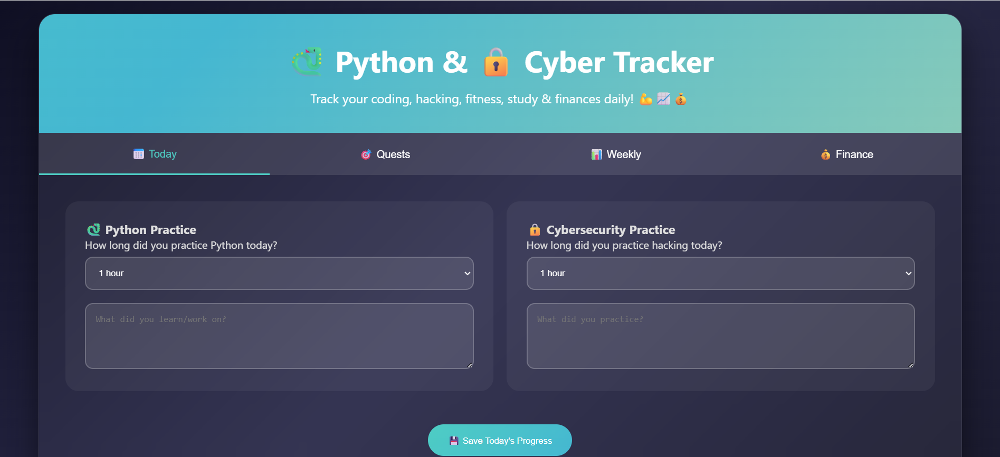

# Progress Tracker 🚀

A simple web-based progress tracking system to track tasks, goals, or learning progress with a clean and responsive UI.

---

## 📌 Features
- Track daily/weekly progress
- Mark completed tasks
- Visual progress indicator
- Responsive design for mobile and desktop

---

## 🛠 Tech Stack
- HTML
- CSS
- JavaScript

---

## 📸 Screenshots



---

## 🚀 How to Run
```bash
git clone https://github.com/surajsarkar-cyber/Progress-Tracker
cd Progress-Tracker
open index.html
